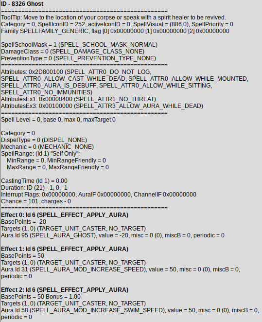

# AzerothCore Module Ghost Speed

- Latest build status with azerothcore:

[](https://github.com/sogladev/mod-ghost-speed)

This is a module for [AzerothCore](http://www.azerothcore.org) that changes the speed of Ghost

- Modifies ghost speed to use custom values


## How to install
https://www.azerothcore.org/wiki/installing-a-module

1. Modify value(s) `src/mod_ghost_speed.cpp`
2. Requires source recompilation
3. Modify database (should be done automaticly)

```
amount = 200; // default: 50
```

example values:
```
50  default
200 fast
500 zoom
```

Apply database changes (this should be done automaticly): `data/sql/db-world/base/ghost_speed.sql`
```
DELETE FROM `spell_script_names` WHERE `spell_id` = 8326;
INSERT INTO `spell_script_names` (`spell_id`, `ScriptName`) VALUES (8326, 'spell_ghost_speed_aura');
```

## How to remove

1. Undo database changes: `optional/undo_ghost_speed.sql`
```
DELETE FROM `spell_script_names` WHERE `spell_id` = 8326;
```

2. Remove `mod-ghost-speed` folder

## Resources
ghost speed is set by aura 8326

example of usage in the core
- https://github.com/azerothcore/azerothcore-wotlk/blob/a196f7f28aa263dc7f9c532e15839f3b409fb68f/src/server/game/Handlers/CharacterHandler.cpp#L957

modifying the bp set by this aura with an AuraScript sets a custom speed

Spellwork 8326



## How to create your own module

1. Use the script `create_module.sh` located in [`modules/`](https://github.com/azerothcore/azerothcore-wotlk/tree/master/modules) to start quickly with all the files you need and your git repo configured correctly (heavily recommended).
1. You can then use these scripts to start your project: https://github.com/azerothcore/azerothcore-boilerplates
1. Do not hesitate to compare with some of our newer/bigger/famous modules.
1. Edit the `README.md` and other files (`include.sh` etc...) to fit your module. Note: the README is automatically created from `README_example.md` when you use the script `create_module.sh`.
1. Publish your module to our [catalogue](https://github.com/azerothcore/modules-catalogue).

